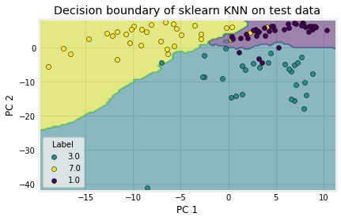

# K-Nearest Neighbors & K-Means Clustering

> **Exercise 03**: Dive into the world of classification and clustering with handwritten digits!

## What's Inside?

This exercise explores two powerful machine learning algorithms:

- **K-Nearest Neighbors (KNN)** - Supervised learning for digit classification
- **K-Means Clustering** - Unsupervised learning for pattern discovery

## Dataset

**MNIST Handwritten Digits** - The classic computer vision dataset with 70,000 images of handwritten numbers (0-9)

## Key Learning Objectives

- **Supervised vs Unsupervised Learning** - Understanding the fundamental difference
- **Distance Metrics** - How algorithms measure similarity
- **Clustering Visualization** - See patterns emerge from data
- **Performance Analysis** - Compare accuracy and computational efficiency
- **Hyperparameter Tuning** - Find the optimal K values

## Files Overview

| File | Description |
|------|-------------|
| `Ex03_KNN_KMeans.ipynb` | Main exercise notebook |
| `Ex03_KNN_KMeans_V3_Solution.ipynb` | Complete solution |
| `ML4MatSci_2024_Ex3_Clustering.pdf` | Exercise instructions |
| `MyPCA.py` | PCA implementation from Exercise 02 |
| `*.png`, `*.gif` | Visualizations and illustrations |

## Visual Highlights

- **Decision Boundaries** - See how KNN creates classification regions
- **Clustering Animation** - Watch K-means converge in real-time
- **Cross-validation** - Understand model validation strategies

---

Part of the ML4MatSci course - Where machine learning meets materials science!
